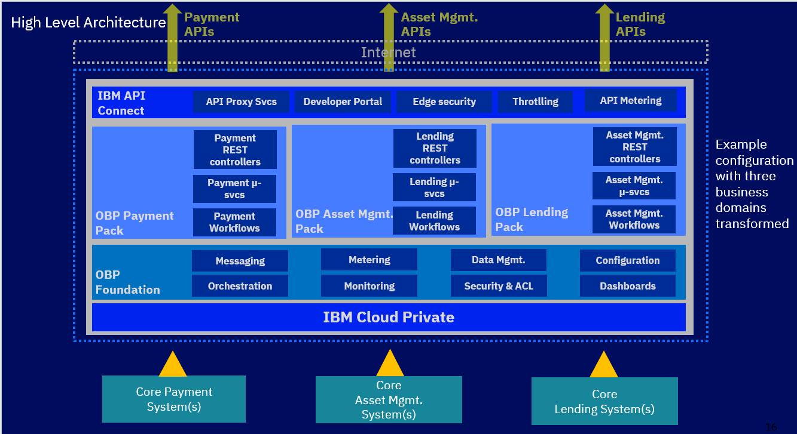
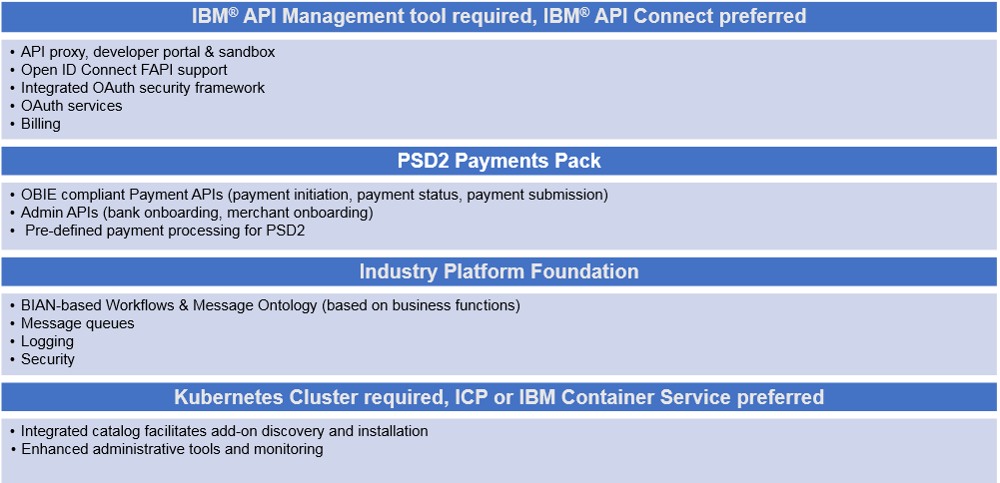
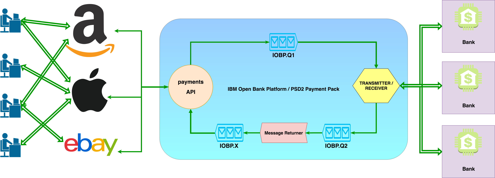

---

copyright:
  years: 2018
lastupdated: "2018-10-12"

---

<!-- Common attributes used in the template are defined as follows: -->
{:new_window: target="_blank"}
{:shortdesc: .shortdesc}
{:codeblock: .codeblock}

# Product architecture

## Introduction

{{site.data.keyword.iobp_full}} is a software suite that accelerates a bank’s transformation to a platform economy. Built across critical business domains such as payments, lending, and so on, it uses an end-to-end, hybrid cloud, micro-services architecture based on industry standards and open source software. This document provides an overview of the solution design, features, and underlying technology stack.

Key differentiators include:
* Hybrid cloud solution built on Kubernetes, Docker and microservices architecture with an option to run on-premise private cloud or public cloud
* Built by business domain influenced by BIAN, IFW, PSD2, and other Open Banking Standards
* Using Open Source Software (OSS) standards
* Access to a modular micro-services layer via REST APIs on top of an existing core system
* Modular plug-and-play design of {{site.data.keyword.iobp_short}} packs
* Following Agile and Test Driven Development principles
* Access to a curated catalog of FinTech partners
* Out of the box product that accelerates the bank’s digital transformation 
* Built with extensive expertise on both legacy systems and emerging technologies

Product components include:
* Business Domain Packs such as Payments Pack
* Foundation Layer
* IBM Cloud Private preferred, Kubernetes required as a prerequisite
* IBM API Connect preferred, API management tool required as a prerequisite

## Application solution
The solution implements the Open Banking UK version 1.1.0 with the intention of being PSD2 
compliant. For more information, see [Payment Initiation API Specification - v1.1.0](https://openbanking.atlassian.net/wiki/spaces/DZ/pages/5786479/Payment+Initiation+API+Specification+-+v1.1.0). 

### Solution design overview
{{site.data.keyword.iobp_short}} is a cloud product that consists of a Foundation layer and individual Business Domain Packs. The Business Domain Packs can be plugged into the Foundation architecture. Each of these Business Domain Packs will focus on their core business logic and associated requirements while letting the Foundation layer and underlying IBM Cloud Private infrastructure handle shared functionality such as messaging, storage, configuration, 
logging, scaling, telemetry, security, load balancing, billing, and so on. 

The following image outlines the platform architecture and functionality.

### Open Banking Platform features

The following image outlines the platform features and functionality in more detail with a deep dive on the Payments Pack.

### Payment Pack
#### Payment Pack APIs

The Payment Pack contains the Payment APIs, Transaction History, and the payment workflows. 

For information about the endpoints for Merchant, Bank, Transaction History, and Payments, see the API Reference.

The following image shows the Request to Pay sequence.

#### Payment workflows

The current stack is written with three main layers that communicate through message queues. Following a microservices architecture, each component runs as a separate pod. This way, if any pod needs to scale, they can replicate individually instead of replicating the entire Payment Pack.

The following image shows the payment workflows.

The API Controller (entry point) accepts the incoming transaction request and returns the response.

The transformation components in the Functional Pack execute the JSON and XML transformations to the target format (downstream and upstream¬), in our case ISO20022 (PACS008 & PACS002).
  
The Transmitter/Receiver uses the target input format to call the appropriate endpoint of the CMA and returns the response format.

##### API Controller

The API controller is generated from the Swagger OpenAPI specification in Node.JS and Express.js and Swagger middleware libraries to enhance compatibility with API Connect.

##### Transformation Layer

The transformation layer (T1…n) of components handles all the explicit transformation from the PSD2 JSON to an intermediary format (ISF), then to the target format (ISO20022). The transformation components are implemented using the Java Spring Framework following microservices and distributed systems design principles.

Currently there are six transformation components in the Payment Functional Pack:

* Downstream
a. PSD2 to ISF
b. Router
c. ISF to PACS008 and PACS028 (ISO20022)
* Upstream
a. PACS002 (ISO20022) to ISF
b. Router
c. ISF to PSD2 

The intention of the Router is dependent on the target destination. The Router sends the message to the proper component for the next transformation.

##### Transmit and Receive

The Transmitter/Receiver (Tx/Rx) takes the target input format and discovers the service destination endpoint of the CMA and calls the destination endpoint. The response is passed to the next component.

## Transaction Repository
The transaction history is an audit log that records events such as when a payment submission is created or the status of the creation of a payment submission is requested. When a merchant makes an inquiry about their transaction, the transaction can look up the transaction and use this API to ETL data out.

All transactions flowing into the system from both directions (from the merchant and from the bank) will be saved into a CouchDB database. This includes both the request and response for the payment APIs.

#### Security Scope

Only administrators with permission to read or archive are allowed. This includes Transaction Read and Transaction Archive.

#### API
To access the Transaction History API, see [Transaction History API](https://developer.ibm.com/api/view/id-3591:title-Transaction_History:token-28db8d2aed34570ff8774532c32565ee#doc).

### Securing Endpoints
Securing the endpoints for {{site.data.keyword.iobp_short}} involves securing the external facing endpoints as well as how the Platform interacts with the compliant Banks. {{site.data.keyword.iobp_short}} provides the OAuth2.0 authorization server to protect and secure all the endpoints on the resource server(s) between itself and the caller of its APIs.

For payment interactions between {{site.data.keyword.iobp_short}} and the Bank, {{site.data.keyword.iobp_short}} follows the protocol set forth by the Bank. In the case of the OBIE Sandboxes, it uses a profile of OAuth 2.0 named OpenID.

For information about configuring a native OAuth provider,see [Configuring a native OAuth provider](https://www.ibm.com/support/knowledgecenter/en/SSMNED_2018/com.ibm.apic.apionprem.doc/oauth_native_apim.html).

#### Merchant and TPP Flow
During the onboarding process, a Merchant will receive a Client ID & Client Secret. The Merchant can then proceed by making Client Credentials Grant calls to obtain an access token. Next, the Merchant can then make Payment API calls or Onboarding API calls.

From this point, the rest will proceed as normal based on the OBIE specification if Payment API calls are made.

##### Access Token Lifetime

The default will be 60 seconds.

##### Scope

A Merchant will be limited to payment, onboarding-read, and onboarding-write scopes.

* Payment grants access to the payment APIs – Initiation, Submission, Status Initiation and Status Submission.
* Onboarding-read grants access to the read APIs for the Merchant Onboarding details.
* Onboarding-write grants access to the write APIs for the Merchant Onboarding details.

#### Bank and TPP Flow

During the onboarding process, {{site.data.keyword.iobp_short}} receives Client ID & Client Secret from a Bank. {{site.data.keyword.iobp_short}} uses these credentials to make a Client Credentials Grant call to the target Bank to receive an access token to perform Payment Initiation Calls.

A Bank will also receive Client ID & Client Secret from {{site.data.keyword.iobp_short}} (similar to a Merchant) to make Onboarding API calls.

#### Access Token Lifetime
The default will be 60 seconds.

#### Scope
A Bank will be limited to onboarding-read and onboarding-write scopes.

* Onboarding-read grants access to the read APIs for the Bank Onboarding details.
* Onboarding-write grants access to the write APIs for the Bank Onboarding details.

### Technology Stack
The technologies used in the {{site.data.keyword.iobp_short}} solution are built upon Kubernetes and Docker stack with additional Open Source Software (OSS) required to support the open banking architecture. The stack was chosen to follow cloud, micro-services, container, and open-source design principles. 

Foundation Layer (Open Source):

* RabbitMQ
* Java Spring Framework / Spring boot / Spring cloud / Spring stream
* Node.js / Express.js / Loopback.io
* CouchDB
* PostgresSQL

IBM API Connect:

* Edge Security
* Developer Portal
* API Proxy
* API Metering
* IBM Cloud Private
* Kubernetes
* Helm
* Docker
* ELK

The Integration will be completed by calling the {{site.data.keyword.iobp_short}} APIs over VPN.
